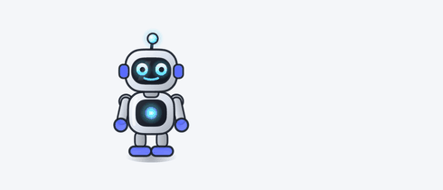
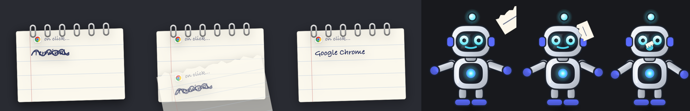
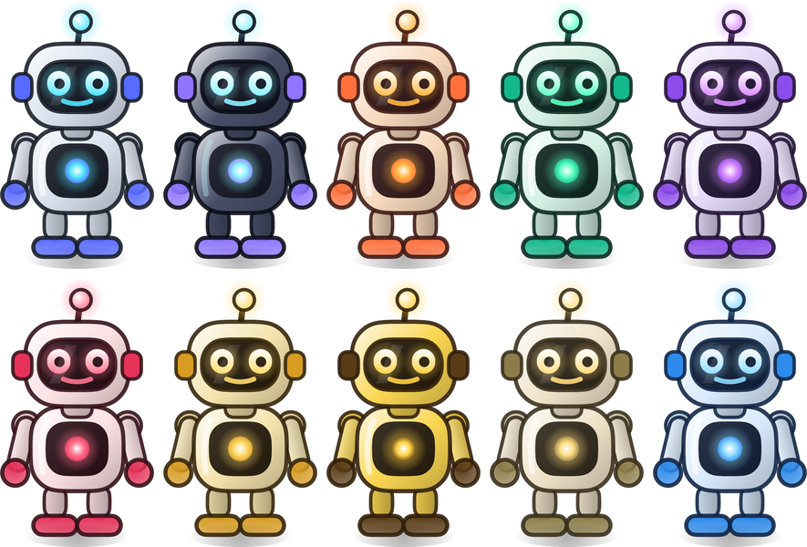

<h1 align="center">Slicky</h1>

<p align="center"></p>

<p align="center">
  <em>A small robot who lives on your desktop, hops around when the mood takes him,<br>
  and opens your apps because you asked nicely.</em>
</p>

---

Your Mac has a Dock. The Dock is fine. The Dock has never once been excited to
see you.

Slicky floats above your windows, blinks, bobs, watches your pointer, and every
half a minute or so decides that where he is standing is no longer the correct
place to stand — so he crouches, fires his thrusters, and hops somewhere else.
Click him and he opens an app. That's the whole product. There is no cloud
component. He does not want your email address.

## Get him

Grab the latest `Slicky.zip` from
[Releases](https://github.com/ananthasharma/Slicky/releases), unzip, and drag him
into `/Applications`. Releases are signed and notarised, so he opens like any
other app — no scary dialog, no right-click ritual.

Or build him yourself, which is more fun:

```bash
git clone https://github.com/ananthasharma/Slicky.git
cd Slicky
./build.sh
open dist/Slicky.app
```

`build.sh` compiles the Swift package, assembles the bundle, renders the app
icon *from the robot himself* (he is his own icon; there are no image assets in
this repo), and signs it. You need Xcode's command line tools and macOS 14+.

If you have a **Developer ID Application** certificate in your keychain it gets
used automatically, with the hardened runtime, ready for notarisation. If you
don't, the build falls back to an ad-hoc signature, which is perfectly fine for
running him yourself and no use at all for handing to anyone else.

```bash
./build.sh              # build and sign
./build.sh --universal  # Apple Silicon and Intel
./build.sh --release    # universal, notarised, stapled, zipped for publishing
```

A Developer ID certificate signs with the hardened runtime and a secure
timestamp automatically. Until the build is notarised, Gatekeeper will report
`rejected / source=Unnotarized Developer ID`, which is normal and only matters
for builds other people download.

Notarising needs a stored credential, once:

```bash
xcrun notarytool store-credentials "slicky-notary" \
    --apple-id you@example.com --team-id ABCDE12345 \
    --password <an app-specific password from appleid.apple.com>
```

Releases are checked against an expected team identifier before they ship,
because the updater only accepts downloads signed by the same team as the
installed copy — signing with the wrong certificate would cut every existing
install off from updates. Forking? Set `SLICKY_TEAM_ID` to your own team, or to
an empty string to skip the check.

| Variable | What it does |
| --- | --- |
| `SLICKY_IDENTITY` | Use a specific signing certificate |
| `SLICKY_TEAM_ID` | Expected team identifier for signed builds |
| `SLICKY_NOTARY_PROFILE` | notarytool profile name (default `slicky-notary`) |
| `SLICKY_VERSION` | Override the version instead of reading the git tag |

Drag `dist/Slicky.app` into `/Applications` if you want to keep him. Do that
*before* switching on Launch at Login, unless you enjoy explaining to macOS
where the app went.

## Living with him

| You do | He does |
| --- | --- |
| Click | Opens the app you bound to click |
| Double-click | Opens the other one |
| Right-click | Menu: apps, jump, say hi, selfie, settings, quit |
| Drag him | Picks him up. He flails. It's fine, he likes it |
| Drag an app onto him | See below, it's the best part |
| Ignore him | He hops around your screen until you don't |

He has no Dock icon and no menu bar item, because *he* is the interface. Open
the app again from Finder and Settings appears. Quit from his right-click menu,
or from the footer of any Settings tab.

The transparent space around him is click-through, so he never eats a click
meant for whatever is behind him.

## Handing him an app

<p align="center"></p>

Drag any app onto Slicky. He throws his arms up to catch it, produces a small
ruled notepad, **scribbles out** the old binding, **tears the page off**, and
then — because he is a professional and evidence is evidence — **eats it**.
Crumbs and all. The new name is written on the fresh page underneath.

Where it lands is up to your fingers:

| Drop with | Goes to |
| --- | --- |
| nothing held | single click |
| ⌥ held | double click |
| ⌘ held | the right-click menu |
| several apps at once | the right-click menu |

Non-apps bounce off. He's picky.

## Clicking him

A single click has to wait out the system double-click interval before it can be
certain you weren't about to click twice. Half a second of nothing looks broken,
so instead: he squashes under your press, then goes wide-eyed and coiled with
his antenna buzzing while the clock runs. When it fires he holds the app's icon
over his head and throws a ring of light — one for a click, two for a
double-click — and hops out of sheer enthusiasm.

## Dressing him

<p align="center"></p>

Seven presets — Chrome, Midnight, Sunset, Mint, Grape, Cherry, Gold — or pick
**Shell**, **Accent** and **Glow** yourself. One shell colour drives every panel,
joint and highlight through derived ramps, so even a colour chosen at 2am looks
deliberate. His body sheen flips from white to a soft glow on dark shells, which
is the only reason Midnight doesn't look like a smudge.

## Selfies

Right-click → **Take a selfie**. You get a transparent PNG of Slicky alone — no
window, no background, no desktop, alpha-trimmed to his silhouette at roughly
1100×1900 — in `~/Downloads`, opened for you. He is captured in whatever pose he
happened to be in, wearing his current colours, smiling.

Yes, this exists so you can put him in a presentation. No, nobody will ask why.

## Getting out of the way

Settings → Behaviour → **Get out of the way when I'm typing**. When the text
cursor ends up underneath him, he hops aside rather than sitting on your words.

This one needs **Accessibility** permission and there's no way around it: the
caret's position is only readable through the Accessibility API, and macOS gates
global key events on the same permission. Only the *fact* that a key was pressed
is used — the event is never inspected, nothing is logged, nothing leaves your
Mac. He genuinely does not care what you typed.

## Updates

_ face">

He checks GitHub for a newer release a few seconds after launch, and if that
fails for any reason at all, he shrugs and says nothing.

When there *is* one, his face changes to `>` and `_` — and only the `>` follows
your pointer, which is either charming or unsettling depending on your evening.
**About Slicky → Install and Restart** downloads the release, checks it really is
Slicky and that its signature verifies, swaps the bundle, and relaunches. If the
copy fails it rolls the old one back.

To cut a release, **tag first** — the build takes its version number from the
tag, and a build whose version doesn't match its tag will offer itself as an
update forever:

```bash
git tag v1.1
./build.sh --release        # universal, signed, notarised, stapled, zipped
```

That leaves `dist/Slicky.zip` to attach to the release. `--release` refuses to
run without a tag (or an explicit `SLICKY_VERSION=1.1`) and warns if the working
tree is dirty.

The updater checks more than "is this a valid signature" — a valid signature only
proves nobody tampered with a bundle *after* it was signed, and anyone can sign a
bundle claiming to be Slicky. So when the running copy is properly signed, the
download must carry the **same team identifier** or it's refused. Ad-hoc builds
have no team, so building from source still updates normally.

## Settings

A slim strip keeps Slicky in view with *Jump*, *Say hi* and *Selfie*, then four
tabs so nothing has to scroll:

- **Apps** — click bindings, and the extra apps in his right-click menu
- **Look** — colours and size
- **Behaviour** — hop interval, hop distance, randomised waits, pointer
  tracking, floating above full-screen apps, typing dodge, launch at login
- **About Slicky** — version, updates, the repo, and coffee

**Hop timing** deserves a note: the slider sets roughly how long he waits, and
*Randomise the wait* adds a fresh **0.1–3.14 seconds** on top of every wait. Yes,
π. No, there isn't a good reason. He simply refuses to be metronomic.

Everything lives in `UserDefaults` under `com.slicky.desktop`. To wipe him back
to factory settings:

```bash
defaults delete com.slicky.desktop
```

## Things that were harder than they look

A short list, in case you were about to build one of these and wondered why it
took a whole weekend:

- **The transparent margin.** The window server routes the *entire* window
  rectangle to the window, transparent pixels included, so click-through has to
  be done by hand: the panel switches `ignoresMouseEvents` on and off depending
  on whether the pointer is inside the robot's actual silhouette.
- **Which then broke drag and drop.** A window that ignores the pointer is never
  offered to drag sessions, and the candidate windows are chosen when the drag
  *begins* — at which point your pointer is over Finder, not over Slicky.
  Switching on mid-drag is far too late. The fix is to become event-visible on
  the global mouse-**down** that precedes any drag; that press has already been
  routed elsewhere, so nothing is stolen from the app underneath.
- **Squash and stretch needs somewhere to go.** The robot is drawn in a 160×200
  box that sits inside a larger 176×270 canvas, because a robot mid-stretch with
  his arms up and his thrusters lit does not fit in his own outline. The
  controller adds that margin back when working out how close to a screen edge
  he's allowed to stand.

## Feature requests, bugs, and other ideas

**Yes, please.** Open an issue. Open a PR. Fork him entirely and give him a hat.

If you want him to do something he doesn't do yet, say so — feature requests are
very welcome and will be handled **in due time**, which is a phrase doing a lot
of honest work here. This is a robot who eats paper for a living; nothing is
being promised on a schedule. But good ideas do get built.

If you're sending a PR: keep it in the style of what's already there, and if
you're touching the drawing, `--preview` renders him offscreen so you can see
what you did without squinting at a corner of your screen.

## Under the hood

```
Sources/Slicky/
  main.swift           entry point and the dev-only CLI modes
  IconExport.swift     renders the app icon and design previews from the robot
  AppDelegate.swift    accessory-app lifecycle
  PetController.swift  placement, hop physics, click routing, drops, menu
  PetPanel.swift       the floating panel, mouse handling, silhouette hit-testing
  PetModel.swift       animation state and the pose it resolves to each frame
  RobotView.swift      the robot, drawn entirely in a SwiftUI Canvas
  Palette.swift        colour presets and the ramps derived from them
  Notepad.swift        the rebind ceremony
  NotepadView.swift    paper, scribble, tear-off
  Selfie.swift         transparent cut-out render
  Updater.swift        release check, download, verify, swap, relaunch
  TypingWatcher.swift  Accessibility caret lookup
  SettingsView.swift   the tabbed settings window
  Config.swift         persisted configuration
  Debug.swift          env-var tracing
```

Idle drawing runs at 15fps and the frame loop stops completely when he's hidden
behind something, so an occluded robot costs nothing. Visible, he's a few
percent of one core, which is roughly what he's worth.

Dev toys:

```bash
SLICKY_DEBUG=1 SLICKY_INTERVAL=5 ./dist/Slicky.app/Contents/MacOS/Slicky   # trace him
./.build/release/Slicky --preview out.png t=0.6 p=0.14 e=1 palette=Mint    # render a pose
./.build/release/Slicky --selfie                                           # selfie from the CLI
./.build/release/Slicky --check-update                                     # run the update check
./.build/release/Slicky --export-icon iconset/                             # icon PNGs
./.build/release/Slicky --notepad-shot out/                                # the pad, mid-ceremony
```

`SLICKY_FPS` overrides the idle frame rate for profiling, and
`SLICKY_NO_CLICKTHROUGH=1` pins the panel to always accept mouse events, which
is how the drop bug above got diagnosed.

## Coffee

I love coffee. Who doesn't. If Slicky made you smile, or saved you a trip to the
Applications folder, feel free to buy me one:

### ☕ [buymeacoffee.com/ananthasharma](https://buymeacoffee.com/ananthasharma)

No pressure. He'll keep hopping either way.

---

<p align="center"><sub>Released builds are signed and notarised and just open. A build
you made yourself is ad-hoc signed, which is fine on your own Mac and will be refused if you
copy it to another one — approve it there in System Settings → Privacy &amp; Security.</sub></p>
